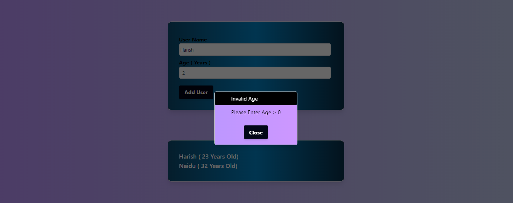

# Add User React Project

Add User Project is a simple ReactJS Application developed to understand and implement React Popups and Validations.

# App UI

- Validation & Error Popup for Empty Submission

-Validation & Error Popup for Invalid Age Submission

## Tools & Technologies

- ReactJ
- Tailwind
- Git & GitHub
- VS Code
- Vercel

## Getting Started

Clone down this repository. You will need `node.js` and `git` installed globally on your machine.

## 🛠 Installation and Setup Instructions

1. Installation: `npm install`

2. In the project directory, you can run: `npm start`

Runs the app in the development mode.\
Open [http://localhost:3000](http://localhost:3000) to view it in the browser.
The page will reload if you make edits.
